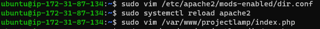

# Gabriel's Documentation of Project 1

## STEP 1 - Installing Apache and Updating the Firewall

1. Update a list of packages in the package manager

-  `sudo apt update`

2. I installed Apache2 using *apt*

-  `sudo apt install apache2`

3. I checked Apache status to see if it is running
    
- `sudo systemctl status apache2`

4. I then tested how the Apache HTTP Server responds to request from the internet and the out is what I have below 

## STEP 2 - Installing MYSQL

1. Acquired and installed MySQL using *apt*

- `sudo apt install mysql-server`

## STEP 3 - Installing PHP

1. Installed 3 PHP packages; php, php-mysql, libapache2-mod-php.

- `sudo apt install php libapache2-mod-php php-mysql`

2. I then confirmed the php version i installed

- `php -v`

## STEP 4 - Creating a Virtual host for a website using Apache
*I am setting up a domain called **projectlamp***

1. Created a directory for projectdomain using mkdir

- `sudo mkdir /var/www/projectlamp`

2. Assign ownership of the directory with my current system user

- `sudo chown -R $USER:$USER /var/www/projectlamp`

3. Created and open a new configuration file in Apache’s sites-available

- `sudo vi /etc/apache2/sites-available/projectlamp.conf`

4. To show the new file in the sites-available directory. I used the commade below

- `sudo ls /etc/apache2/sites-available`

5. I uses the a2ensite command to enable the new virtual host

- `sudo a2ensite projectlamp`

6. I then disabled Apache’s default website using the a2dissite command;

- `sudo a2dissite 000-default`

7. I checked for syntax errors by running

- `sudo apache2ctl configtest`

8. Reloaded Apache to effect changes

- `sudo systemctl reload apache2`

9. Created an index html file for the new website

- `sudo echo 'Hello LAMP from hostname' $(curl -s http://169.254.169.254/latest/meta-data/public-hostname) 'with public IP' $(curl -s http://169.254.169.254/latest/meta-data/public-ipv4) > /var/www/projectlamp/index.html`

## STEP 5 - Enable Php on the website

1. To enable PHP on the website, I started by editing the Apache file within the DirectoryIndex

- `sudo vim /etc/apache2/mods-enabled/dir.conf`

2. I reloaded the apache

- `sudo systemctl reload apache2`

3. I created a new file names index.php

- `sudo vim /var/www/projectlamp/index.php`

4. Then I refreshed my brower to see the server from Php perspective

5. Lastly, i removed the file I created
`sudo rm /var/www/projectlamp/index.php`

- and refreshed my browser

